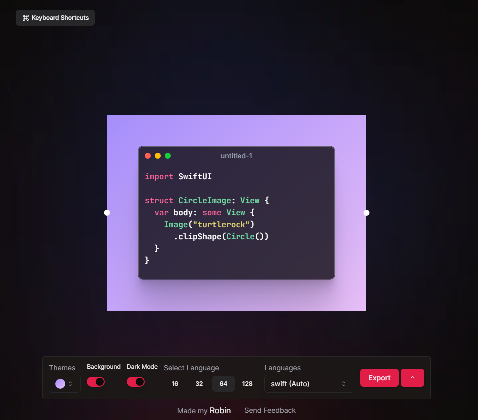
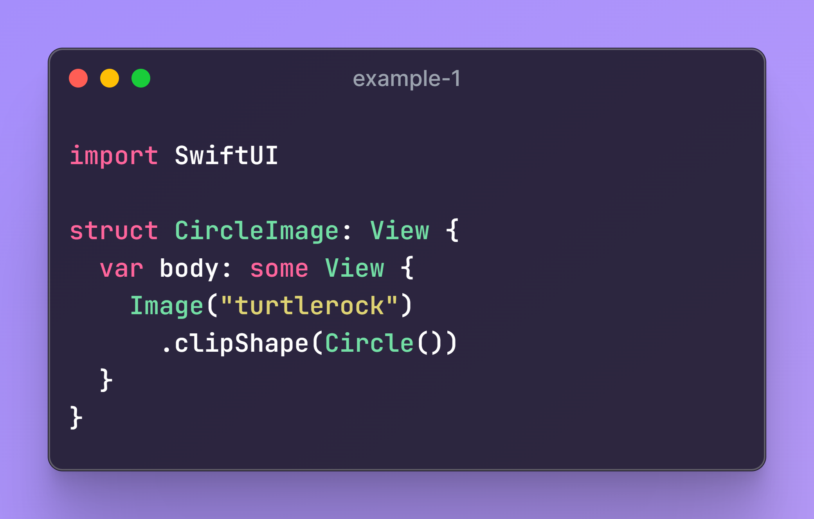
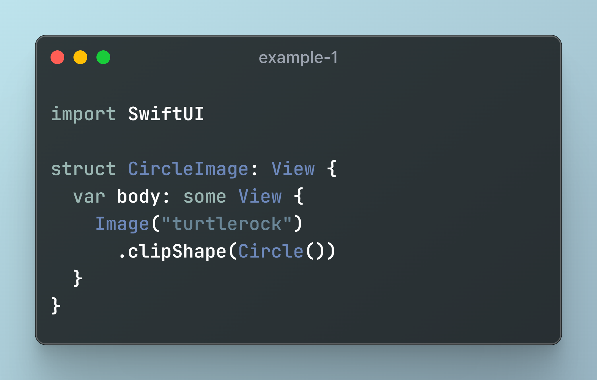
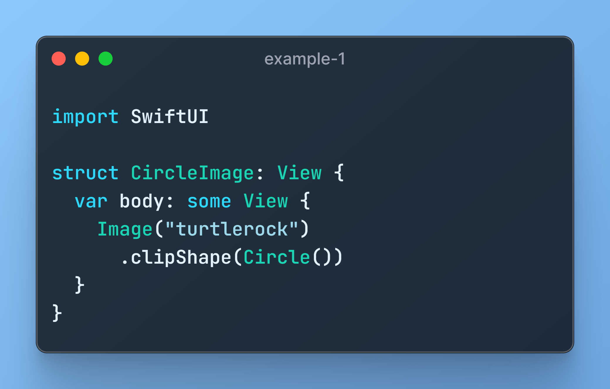

  
  <h3>
    <b>
     Code Snapshot
    </b>
  </h3>
  <b>
    Open Source Code to Image Snapshot generator
  </b>
  

 

  

 
   
  

    <a href="https://codesnapshot.vercel.app">
      <picture>
        <source media="(prefers-color-scheme: dark)" srcset="./images/banner.png">
        <source media="(prefers-color-scheme: light)" srcset="./images/banner.png">
        
      </picture>
    </a>
  

## Examples:

  
  
  

### **Features**

❤️ **Lightweight:** Crafted with minimalistic UI design.

⚡️ **Fast:** Show preview or snapshot realtime.

🌈 **Thems:** Customize able code thees

🔥 **PWA:** Install as a [Progressive Web App](https://web.dev/progressive-web-apps) on your device.

- Low RAM/memory and CPU usage
- Add to Home Screen
- Desktop PWA - ( Comming soon )
